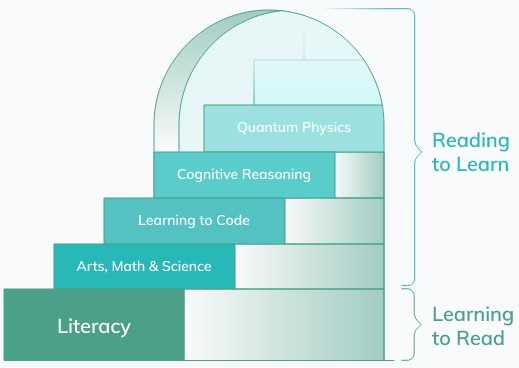
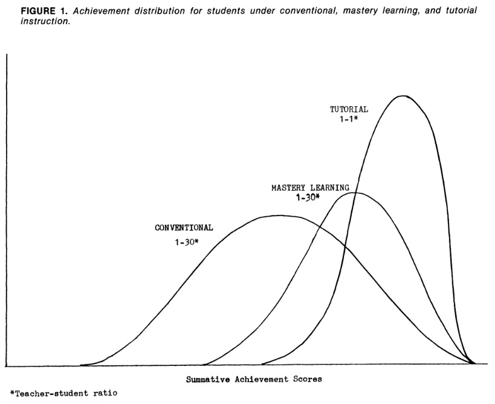
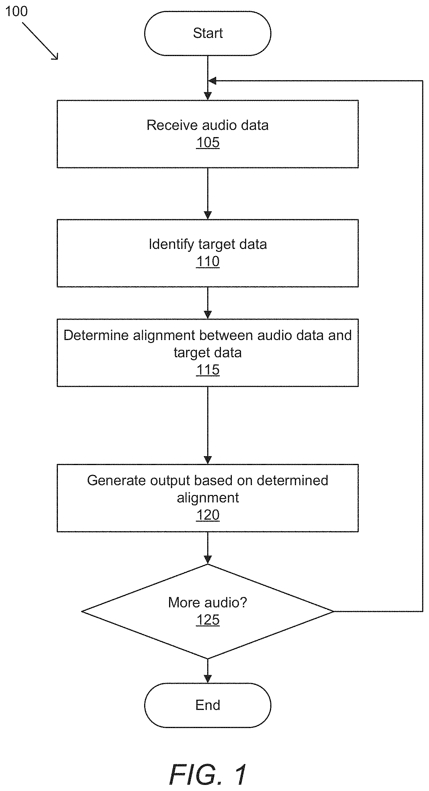
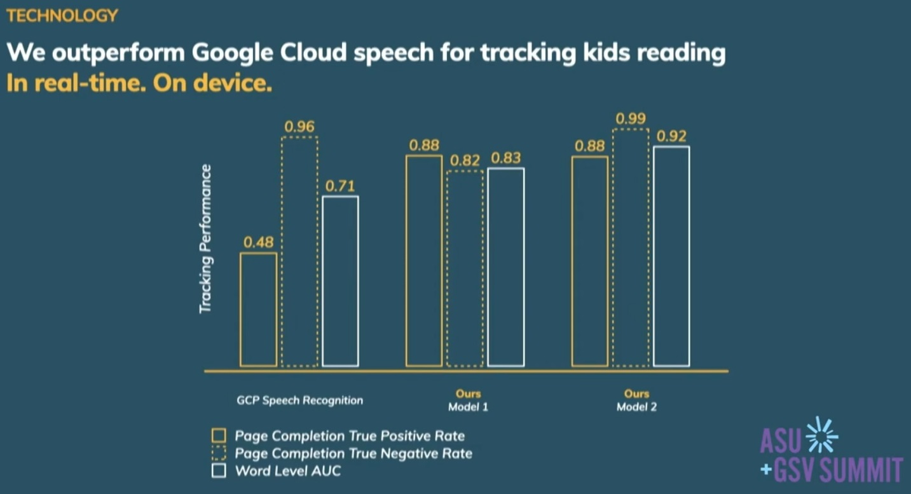

# Hello Ello: My Wish Come True

   ### CONTENTS
**[My Wish](#my-wish)** 
**[The Landscape of Education](#the-landscape-of-education)** 
**[Origin and Overview of Ello](#origin-and-overview-of-ello)** 
**[A World-wide Problem](#a-world-wide-problem)** 
**[Ello’s Business Activities](#ellos-business-activities)** 
**[Technology Research and App Building](#technology-research-and-app-building)** 
**[Ello’s U.S. Patent Pending](#ellos-us-patent-pending)** 
**[Showing Promising Results](#showing-promising-results)** 
**[Comparison of Competition](#comparison-of-competition)** 
**[A Big “Oh No!”](#a-big-oh-no)** 
**[My Recommendation to Ello](#my-recommendation-to-ello)** 

## My Wish

It was in a job interview in 1999 that I was asked if I could program storybook software used for teaching beginning readers. The books were already written,[^1] but the company wanted to digitize them. The way the question was asked left some ambiguity: *Was the interviewer asking if the program needed to be such that the child would read to the program and have it recognize correct reading, or the computer would read the story to the child?*

[^1]: See *Start Reading* as described in the ECRI catalog page 16: https://www.ecri.cc/catalog/Student_Texts.pdf. Note: the digital version is no longer offered as Version 1 for Windows 98 no longer works, and Version 2 for Java was retired as Java has fallen out of favor.

My thoughts processed the question, the ambiguity, and the realization that I could not, nor could anyone in the world that day, program the first scenario. Speech recognition was in its infancy. Commercially available speech-to-text software such as *Dragon Naturally Speaking* had to be ‘trained’ on an individual basis by having the end user read pre-prepared text; thus, it certainly could not recognize a non-reader.

Upon clarification of the ambiguity, the potential employer was okay with having the program read to the child, and then the child would read to a live teacher, tutor, or parent who would also conduct oral comprehension tests after each story. The computer would be an assistant only in the teaching process. That was something I could do easily, and I got the job. However, I wished then and since that I, or anyone else, could someday create such a program as the first scenario. Well, hello, [Ello](https://www.helloello.com/)—you’ve made my wish come true!

## The Landscape of Education

All education starts with literacy, and gaining literacy starts the moment we are born. For example, *Enriching a Child’s Literacy Environment (ECLE)* is a program intended for children from six months to three years of age. Parents and classroom teachers are provided instruction on how to increase their children’s early literacy through activities designed to “develop large and small muscle coordination, oral language through sensory stimulation, print and number awareness, appreciation of literature, sensitivity to music and rhythm, and basic concepts.”[^2]

[^2]: https://www.ecri.cc/ecle/

Experts have known for a long time the importance of teaching literacy very early in life. In a question and answer session with *Educational Leadership*, Dr. Sally Shaywitz responded to the question, “We often hear that the first three years are the most important, but is that necessarily the case?”

> “The brain is a living, dynamic organ that is plastic throughout life. It is always taking in information and refining and reinforcing connections once they’re made. But when a child is young, this refining goes on more easily and as a matter of course. You’re starting with so many possibilities. It’s like a house. Think of it this way. It is much harder to renovate an already standing house than it is to build it right from the start.
>
> “To correct a reading problem in 3rd or 4th grade, you almost have to undo certain pathways that the child has developed. But children between 4 and 6 are at the cusp of learning to read. Their spoken language system is in place. They are ready to build the connection to print. It is an incredibly exciting time. They want the sign ‘Go.’ You have wide-open opportunities. You don’t have to undo faulty connections.”[^3]

[^3]: D’Arcangelo, M. (2003, April 1). “On the mind of a child: A conversation with Sally Shaywitz” *Educational Leadership, 60*(7). https://www.ascd.org/el/articles/on-the-mind-of-a-child-a-conversation-with-sally-shaywitz

Other researchers identified critical points in the success rate of literacy by word counts.

> “The best first-grade readers read almost 2,000 words per week. Struggling first-grade children read only 16 words per week (Allington 1983). By the intermediate grades struggling readers have read approximately 100,000 words. The average reader has read 1,000,000, and the most avid readers have read as many as 10,000,000 to 50,000,000 words (Nagy & Anderson, 1984).”[^4]

[^4]: Roller, C. (2000, May), “The International Reading Association responds to a highly charged policy environment,” *The Reading Teacher, 53*(8), 627.

Others have observed that first we learn to read, then we read to learn. Most learning occurs only if literacy is achieved. This concept is visualized by Ello with the following chart:

[^5]

[^5]: https://www.ello.com/

Utilizing technology to increase literacy has a long tradition. Unfortunately, most educational computer games, applications, and apps are not based on research or proven through science. They can be fun for children, but they are not effective. Effective programs are research-based and scientifically proven.

An example of a well-designed computer program for teaching reading and spelling integrated with computer keyboarding skills is the *Keyboarding, Reading, and Spelling (KRS)* program:

> “The program uses a phonetic approach to reading, with the computer being an essential component of the instructional process. The computer does not replace the teacher in instructing, but rather provides opportunities for students to master skills through reinforced practice… Although the teacher teaches some skills, students are independent as they work at the computer.”[^6]

[^6]: ECRI catalog page 30: https://www.ecri.cc/catalog/Media.pdf

The KRS program was developed through research, proven effective with studies, and even validated by the U.S. Department of Education as effective for students in grades one through six. Yet, most off-the-shelf programs marketed toward children don’t have such credentials. Most are not effective. However, with AI rapidly changing every aspect of life, the field of education is being significantly impacted, for good or ill. Let us look at one early reading program, the “Read with Ello” project.

## Origin and Overview of Ello

Ello was founded in 2019[^7] by Tom Sayer, an education entrepreneur; Dr. Elizabeth Adams, a clinical child psychologist; and Catalin Voss, a Stanford AI PhD,[^8] with the goal of building an AI teacher that would scale teaching 1:1.[^9]

[^7]: https://omdena.com/blog/top-yc-companies-ai-startups/ (However, both 2019 and 2020 are listed across various websites.)

[^8]: https://www.ello.com/#about

[^9]: https://www.ello.com/

Why 1:1 teaching? Benjamin Bloom (1984)[^10] observed that the most effective teaching occurs one-on-one.

[^10]: Bloom, B. S. (1984, June – July). “The 2 sigma problem: The search for methods of group instruction as effective as one-to-one tutoring.” *Educational Researcher, 13*(6), 4–16. https://doi.org/10.3102/0013189X013006004

[^11]

[^11]: Ibid. – p. 5

In 1984, that would have been a pipe dream. I suspect Bloom knew that and instead studied the effectiveness of mastery learning environments.[^12] Traditional classrooms generally have one teacher for 15 to 30 students. For instance, “In 2022, Utah had 606,998 students enrolled in a total of 945 schools in 42 school districts. There were 26,168 teachers in the public schools, or roughly one teacher for every 23 students, compared to the national average of 1:16.”[^13] Yet with digital classrooms, it should be possible to create an AI teacher to achieve the 1:1 teacher-to-student ratio.

[^12]: Ibid.

[^13]: https://ballotpedia.org/Public_education_in_Utah

Building an AI teacher first required assembling the right team. A team with backgrounds in “K–12 education, child development, and artificial intelligence”[^14] would be needed. Ello co-founders assembled a team of 40 individuals[^15] from diverse walks of life, spanning a wide age and experience range and from all around the world, with the skills and willingness to advance the research and the technology necessary before a product could even be built.

[^14]: https://www.ello.com/#about

[^15]: As counted from https://www.ello.com/#about on November 24, 2023. I note that this set of bios includes personnel such as assistants and warehouse workers and thus may be the entire employee roster of Ello.

Another step in the process of research and development for an AI teacher is to acquire funding. AI research does not come cheap. Most recently Ello, secured an additional $15 million in 2023 from numerous sources, including Goodwater Capital, Homebrew, Reed Hastings, Common Sense Growth, Ravensburger, Project A, Y Combinator, WndrCo, Reach Capital, Visible Ventures, and Khosla Ventures.[^16] Previous investors, including some of the aforementioned and also Human Capital, K9 Ventures, 27V, Elysium Venture Capital, and UpHonest Capital,[^17] provided about $500,000 in start-up capital.[^18]

[^16]: https://www.edtechreview.in/news/ai-driven-reading-coach-platform-ello-raises-15m-to-revolutionize-child-literacy/

[^17]: https://www.ello.com/#research

[^18]: Calculated from compiled amount showing on https://www.ai-startups.org/top/education/

With a goal to start by building an AI reading coach whereby children would read from everyday books, utilizing evidence-based instruction and motivation to teach children reading in a one-on-one setting, Ello sought to solve “one of the most important issues facing the world today: ensuring all children learn to read, and in doing so helping maximize their potential.”[^19]

[^19]: https://www.ello.com/

## A World-wide Problem

> “In today’s society, the child who doesn’t learn to read does not make it in life. If children don’t learn to read early enough, if they don’t learn to read with comprehension, if they don’t read fluently enough to read broadly and reflectively across all content areas, if they don’t learn to read effortlessly enough to render reading pleasurable, their chances for a fulfilling life—by whatever measure: academic success, financial stability, the ability to find satisfying work, personal autonomy, self-esteem—are practically nil.”[^20]

[^20]: McPike, L. (1995 Summer) *American Educator*. Found in “Beginning Reading Instruction.” *Where We Stand: K-12 Literacy*, p. 3. https://www.aft.org/sites/default/files/wwsk12literacy0407.pdf

However, a recently published NAEP (2021) study found that “About 27 percent of White, 51 percent of Black, and 46 percent of Hispanic fourth-graders fell into the below NAEP Basic group. Black students were also overrepresented in the below NAEP Basic Low subgroup.”[^21]

[^21]: The 2018 NAEP Oral Reading Fluency Study, US Department of Education, NCES 2021-025, https://nces.ed.gov/nationsreportcard/subject/studies/orf/2021025_orf_study.pdf.

Ello found that “Children are 2x more likely to drop out of high school if they are not a proficient reader by the end of the 3rd grade.” and “Children are 4x more likely to remain a poor reader through 4th grade if they are behind in 1st grade.”[^22] Ello also states, “To access the rest of education, and the world’s knowledge, a child must be able to read. Yet, 69% of 4th graders are behind in the USA and literacy is a huge problem globally.”[^23]

[^22]: https://www.helloello.com/

[^23]: https://www.ello.com/

And then came the pandemic, exacerbating the issue: Dominque et al. (2022) found “that students in the first 200 days of the 2020–2021 school year tended to experience slower growth in [oral reading fluency] relative to prepandemic years. [They] also observe slower growth in districts with a high percentage of English language learners and/or students eligible for free and reduced-price lunch.”[^24]

[^24]: Domingue, B. W., Dell, M., Lang, D., Silverman, R., Yeatman, J., & Hough, H. (2022). “The effect of COVID on oral reading fluency during the 2020–2021 academic year.” *Academic Educational Research Association*. https://doi.org/10.1177/23328584221120254.

Ello claims that “reading skills have stalled during the pandemic. Reading fluency in the U.S. is roughly 30 percent behind what would be expected in a typical year,”[^25] based on a Stanford Graduate School of Education study.[^26]

[^25]: https://www.helloello.com/

[^26]: https://news.stanford.edu/2021/03/09/reading-skills-young-students-stalled-pandemic/

These problems are not unique to the US alone, but for brevity, it is enough to understand that the most critical time to teach literacy skills is before Grade 4, and that the world is behind on this endeavor.

## Ello’s Business Activities

Ello has focused on reading literacy from kindergarten to the third grade.[^27] Their first product, “Read with Ello,” or the Ello app, is an AI-driven app that “listens to [the] child read from real books, teaches and motivates them, and transforms them into enthusiastic readers.”[^28]

[^27]: https://www.helloello.com/ello-for-schools

[^28]: https://www.helloello.com/

The product is a subscription-based service ($24.99/month), which sends a box of five books per month for the child to read. The child reads to the app on a tablet (note that desktop support is not yet available and digital mobile phone support is coming soon). The app listens to the child and coaches the child just as a real teacher would. Children are motivated by the rewards they can earn. Books can either be sent back to Ello for free (pre-paid shipping) or purchased for $5 each. Sounds simple, right? But the underlying technology is not so simple.

## Technology Research and App Building

Part of the phenomenal team Ello has assembled includes AI researchers and developers who have already been conducting research in AI technologies and building AI-based solutions for other companies around the world. These include:

- Nick Haber, with a team of five more researchers, proposed the ability to create a truly autonomous artificial agent that would be able to choose behaviors within complex environments without the need for humans to specify tasks or rewards. This is the first step in artificial intelligence systems learning the way infants and children learn. How do children learn? Well, through “play.” So they “constructed a simple self-supervised mechanism that spontaneously generates a spectrum of emergent naturalistic behaviors via an active learning process, experiencing ‘developmental milestones’ of increasing complexity as the agent learns to ‘play’.”[^29]

[^29]: Haber, N. (et al.), (2018). “Learning to Play With Intrinsically-Motivated, Self-Aware Agents.” *Advances in Neural Information Processing Systems 31*. https://proceedings.neurips.cc/paper/2018/hash/71e63ef5b7249cfc60852f0e0f5bf4c8-Abstract.html

- In the wav2vec 2.0 project, Henry Zhou and Michael Auli (and two others) demonstrated that it was possible for machine learning utilizing self-supervised learning (ML) to significantly outperform systems that are trained with even 100 times more labeled data for speech recognition. Many speech recognition systems need thousands of hours of speech that is transcribed to reach acceptable performance. But with wav2vec, the system is trained with unlabeled data and then fine-tuned with 1% of the amount of labeled data other systems would need.[^30]

[^30]: Baevski, A. (et al.), (2020) “wav2vec 2.0: A Framework for Self-Supervised Learning of Speech Representations.” *Advances in Neural Information Processing Systems 33*. https://proceedings.neurips.cc/paper/2020/hash/92d1e1eb1cd6f9fba3227870bb6d7f07-Abstract.html

- Nick Haber combined his efforts with those of four other researchers to push the curiosity of his earlier research to combine the idea of Active World Model Learning (AWML) of a virtual agent with Progress Curiosity, relating how children learn from the world around them while ignoring the white noise of unlearnable stimuli. In their research, they constructed a 3D virtual environment that would appear as a real-world environment with a wide array of realistic stimuli. They then created an AWML system that reinforced a learning framework through curiosity-driven exploration and active learning, which was able to overcome white noise mimicking the behavior of a child (infant or toddler). The hope of this research is to create “a model for intrinsic motivation in early childhood.”[^31]

[^31]: Kim, K. (et al.). (2020) “Active world model learning with progress curiosity.” Proceedings of the 37th International Conference on Machine Learning, 2020;119:5306-15. https://proceedings.mlr.press/v119/kim20e.html

- Catalin Voss and Nick Haber (along with 13 others) studied the potential use of AI models in the diagnostic evaluation of children with autism. Diagnosing autism can be challenging because the symptoms are heterogeneous and multidimensional. While the *Diagnostic and Statistical Manual of Mental Disorders (DSM)* provides for clinical diagnosis, it relies primarily on the behavioral symptoms of the child. With the collection of digital data and the use of machine learning, the rapid classification of medical conditions becomes possible. Therefore, their research reviewed “traditional diagnostic instruments, data-driven feature selection methods, digital questionnaire capture, computer vision approaches, eye tracking approaches, crowdsourcing, and digital interventions used for longitudinal outcome measure tracking.”[^32]

[^32]: Washington, P. (et al.), (2020, August). “Data-Driven Diagnostics and the Potential of Mobile Artificial Intelligence for Digital Therapeutic Phenotyping in Computational Psychiatry.” *Biological Psychiatry: Cognitive Neuroscience, 5*(8), 759-769. https://doi.org/10.1016/j.bpsc.2019.11.015

- Catalin Voss and Nick Haber (along with 17 other researchers) conducted an ML study to improve digital therapy for pediatrics, specifically in the domain of children with developmental and behavioral conditions. In order to track the emotions of children, they built a game that would collect videos of children expressing emotions. The game also allowed for the labeling of emotions. They collected over 2,000 videos with around 40,000 frames expressing emotions and collected more than 100,000 labels. This data set was more than 30 times greater than any other similar pediatric emotion data set. From this data set, they achieved a classifier that was at least 10% greater than previous classifications of child affective facial expression.[^33]

[^33]: Washington, P. (et al.). (2022, April 8). “Improved Digital Therapy for Developmental Pediatrics Using Domain-Specific Artificial Intelligence: Machine Learning Study.” *JMIR Pediatrics and Parenting, 5*(2). https://pediatrics.jmir.org/2022/2/e26760

With this prior research from the assembled team, they had the ability to focus on the biggest hurdle to creating an AI reading coach that would be able to recognize children’s speech as they learn to read. The first step then is the perception of child speech:

> “Children learn by talking, so the best interface for young kids to interact with technology is natural language. But existing speech recognition does not work for children. We’re leveraging advances in self-supervised machine learning to build 10x better child speech perception.”[^34]

[^34]: https://www.ello.com/

The engineering into their proprietary AI speech recognition is the heart of their product and, thus, the subject of their patent discussed later. The next step is understanding the child as the child progresses. The AI teacher would map the cognitive state of the child, building a granular picture throughout every stage of the learning process. In order to engage learners, the AI teacher would be interactive and personalized. This would also be done with large language models that would produce content unique to the interests of each child. The end result would be a learning companion that focuses on the child, not the technology.[^35]

[^35]: Ibid.

## Ello’s U.S. Patent Pending

Seeking to overcome problems found in other speech validation models that rely on a “record-then-review” approach, the patent is for a speech validation system that incorporates position tracking. If a reader mispronounces words, skips words, or jumps around in the text, then models that rely on closed vocabulary cannot keep track of the reader. Recording and reviewing after the fact also removes the continuity of the reader, lowering fluency.[^36]

[^36]: U.S. Patent 2022/0199071 A1 – Field of Invention [0002] and Background [0003]. https://patents.google.com/patent/US20220199071A1/en?oq=US-20220199071-A1

The patent outlines a novel technique that is able to identify a reader’s position within the text and determine the accuracy of reading. The speech validation system can also provide feedback and teach correct pronunciation. Further, the system would provide motivational systems.[^37]

[^37]: Ibid. – Detailed Description [0049]

An example of this process is provided in Figure 1, where we see that they start with receiving audio data (of the child reading), they identify the target data (the story text), and they determine the alignment between the child reading and the story text. Output is then generated based on the determined alignment, wherein additional audio input may continue. Thus, they can continuously track the speech of the reader.

[^38]

[^38]: Ibid. – Figure 1

An interesting feature of this invention is that it can be broken down into sequences of varying lengths, from a whole book to a chapter, a paragraph, a sentence, an individual word, a component of a word, even down to a phoneme. Thus, this system could be used for phonetic sequencing.[^39] One could see how this breakdown would be needed to be able to key in on mispronunciations to be corrective for a child just learning to read.

[^39]: Ibid. – Detailed Description [0051]

The inventors, well versed in child development, leave little lacking. Another example found in the patent application is a method of aligning the audio data of the child to determine if words were missed or even if they may have been repeated, because these scenarios are common for early readers.[^40]

[^40]: Ibid. [0129]

Suffice it to say that their AI-driven reading coach named Ello “listens to [a] child read from real books, teaches and motivates them, and transforms them into enthusiastic readers.”[^41] This is a great advancement.

[^41]: https://www.helloello.com/

## Showing Promising Results

Ello’s CEO, Tom Sayer, boasts of outranking the Google Cloud Speech API by 30%, specifically in tracking a child’s reading. He believes that was the key to making an app that could provide enough social interaction to engage children, spark their innate curiosity, and instill a joy of reading that would last a lifetime.[^42]

[^42]: https://www.edtechdigest.com/2022/12/08/ello/

[^43]

[^43]: https://www.youtube.com/watch?v=-AbK3Zef6BE

Ello’s business is growing, and their customer base includes 10,000 families at home and 100,000 books read by children last year.[^44] Over 300,000 books have been read by children since their launch.[^45] They also provide options for classroom teachers and child tutors. While Ello is a privately owned company and I cannot find published revenue statements, I can estimate their annual revenues to be around $3 million.[^46] That is significant for a business only five years old.

[^44]: https://www.helloello.com/ello-for-schools

[^45]: https://techcrunch.com/2023/09/07/ai-reading-coach-startup-ello-raises-15-million-to-bolster-child-literacy/

[^46]: 10,000 families subscribing for at least $25 per month over the span of 12 months: 10,000 x 25 x 12 = 3,000,000.

Their future plans for growth include designing a product specifically for classrooms, in partnership with schools. With $15 million in funding this year, I have no doubt they will be successful in such a creation.

## Comparison of Competition

In 2017, the AI startup Kadho released a beta version of KidSense.ai, followed by an embedded solution in 2018.[^47] In an introductory video,[^48] they demonstrate a similar app which reads a story to a child, providing a mechanism so that the child can pause the story and ask questions of the app about the story. The app then gives more information, such as definitions or explanations of words. Alas, their website has gone dark. Perhaps they have already gone defunct.

[^47]: https://golden.com/wiki/KidSense.ai-VWKDJ6N

[^48]: https://www.ai-startups.org/video/kidsense/

Already mentioned is the Google Cloud Speech API. While not a true competitor in the early childhood literacy market, their AI product is not as promising at recognizing children’s speech.

SoapBox Labs has also worked on child speech recognition. They have been working on it for longer (since 2013),[^49] and they have the backing of big names in the educational sphere, such as Scholastic, McGraw-Hill, EarlyBird, PBS Kids, and Learning Without Tears, to name a few.[^50] They produce a voice engine that can be used to power other tools for early childhood literacy. It does not directly compete with Ello as a reading app, but it also has promising technology for child speech recognition.

[^49]: https://voicebot.ai/2019/09/25/soapbox-labs-is-schooling-voice-ai-to-understand-children/

[^50]: https://www.soapboxlabs.com/

Duolingo has been building apps to teach language skills to children since 2011. But, again, it’s not a direct competitor to Ello, as its mission is focused on teaching any language to anyone for free.[^51]

[^51]: https://www.duolingo.com/info

Then there is the OrCam AI device, which is said to help a child with ADHD or dyslexia learn to read.[^52] While interesting, this device is not what I was looking for to fulfill my 1999 wish.

[^52]: https://www.orcam.com/en-us/orcam-learn-lp-csd

So I come back to Ello with hope. Yet, upon deep inspection, I find my wishing must continue, at least in part.

## A Big “Oh No!”

It is appalling when an organization’s co-founder tacitly, although perhaps accidentally, admits that their product (in Monty Python parlance) smells of elderberries. Dr. Elizabeth Adams is quoted in TechCrunch as saying:

> “Ello doesn’t test for comprehension. We’re really focused on engagement and the child’s love for reading and growing that confidence… We give children an experience that is based on learning, but also delightful and doesn’t feel like a test.”[^53]

[^53]: https://techcrunch.com/2023/09/07/ai-reading-coach-startup-ello-raises-15-million-to-bolster-child-literacy/

Pronouncing words correctly—even recognition of them on the written page—is not enough. This does not solve the problem discussed near the beginning of this case study. The NAEP study quoted earlier was specifically looking at oral reading fluency.

> “‘Fluency’ is often confused with ‘rate of reading.’ Fluency is more than reading rapidly. Fluency involves reading with expression and observing the distinctive features of the written word within its context: the phrasing based on punctuation, syntax or grammar, and nuances in word and phrase meanings. It is recognizing the emotional climate of the text and providing the correct emphasis on significant words. A fluent reader reads as he would speak—in a natural, easy flow of words... Fluency is tied to the ability of the reader to understand text at the literal, interpretative, and critical levels of comprehension.”[^54]

[^54]: Reid, Dr., E. R. (2006, Spring). “Fluency.” *Mastery Learning And the Teaching of Reading, 24*(1). Salt Lake City, Utah: Exemplary Center for Reading Instruction.

A product that does not teach nor test for comprehension cannot ensure children are comprehending their reading. Without comprehension, the act of reading is quite literally “meaningless.”

## My Recommendation to Ello

It is understandable to want to engage children in reading. Making it a fun thing will instill in them a love of reading. But comprehension should be included, and not just what is written in the story but much more. There are multiple levels of comprehension, which are all important. Dr. Reid identified four main comprehension levels:[^55]

[^55]:  Reid, Dr., E. R. (2010). *Teaching Comprehension (Literal, Interpretative, Critical, and Creative)*. Salt Lake City, Utah: Exemplary Center for Reading Instruction.

- Literal: understanding the details that are actually written, such as the character’s name, appearance, background, age, race, etc.

- Interpretative: a reader is able to add meaning that the author intended but was not written, such as inferring things, understanding the meanings of figurative or metaphorical text, being able to paraphrase and summarize, as well as extrapolating information about the author.

- Critical: a critical reader is thinking about the content of the text beyond the meaning, assessing relevancy, judging accuracy, distinguishing between fact and fiction, recognizing propaganda, etc.

- Creative: a creative reader is good at extending the story, relating the story to their own experiences, and writing their own stories. Yes, reading and writing are interlinked.

Teaching and assessing comprehension need not feel like a school lesson or test for the child. It could, especially with AI models, be nothing more to the child than a dialog with the app about the story they read. The app can provide interest (instruction) and then, in conversation, ask questions about the text (assessment).

I imagine such a scenario with one of my favorite childhood books, *Where the Wild Things Are* by Maurice Sendak, which incidentally is one of the books displayed in the intro video. The conversation after reading the book could go something like the following (psuedo-footnotes after the dialog reference teaching and assessing specific comprehension skills):

> 

>
> **Ello:** *Nathan, this story is about a little boy named Max.{a} One night, he was pretending to be a wolf. What costume was Max wearing that night?{b}*
>
> **Nathan:** *He was wearing a wolf suit.*
>
> **Ello:** *Max’s mother called him a “wild thing.”{c} What wild things did Max do?{d}*
>
> **Nathan:** *Max was putting nails in the wall and chasing a dog.*
>
> **Ello:** *When Max was sent to his room, he began to use his imagination. He imagined a forest growing in his room. What clues are in the story that show he is imaging being a “wild thing?”{e}*
>
> **Nathan:** *A forest can’t grow in a room. He was gone for over two years but didn’t even change his clothes. He became a king by magic.*
>
> **Ello:** *That is interesting. You said he was gone for over two years; how did you determine that?{f}*
>
> **Nathan:** *The story said he sailed through night and day, in and out of weeks, and almost over a year to get to the “wild things” and then sailed back over a year, in and out of weeks, and through a day. That is more than two years.*
>
> **Ello:** *The story says his supper was still hot when he got back.{g} Does food stay hot that long?{h}*
>
> **Nathan:** *No.*
>
> **Ello:** *So do you think this could be another clue that Max was just imaging he went somewhere?{i}*
>
> **Nathan:** *Yes.*
>
> **Ello:** *Have you ever imagined going somewhere far away? If so, where?{j}*
>
> **Nathan:** *Yes, I have climbed tall mountains and visited other planets in my imagination.*
>
> **Ello:** *Do you think Max’s mother loves him? Why?{k}*
>
> **Nathan:** *Of course she does; she gave him his supper, even bringing it to his room.*
>
> **Ello:** *I think the author either has children of his own or works with children because he understands that children like to dress up and pretend to be other animals. He knows children like to daydream and that sometimes they misbehave.{l} How could you find out if Maurice Sendak has children?{m}*
>
> **Nathan:** *I could read a biography about Maurice Sendak or look up information about him on the Internet.*
>
> **Ello:** *Thank you for reading this story to me; it was a fun time we had.*
>
> **Nathan:** *Yes, it was fun, but my wish is only partially fulfilled. Goodbye Ello, but I will check on you from time to time; maybe someday you will understand.{n}* :wink:
> 

**Examples of Teaching and Assessing Comprehension Skills**

 a Teaching: Literal—Character’s Name 
 b Assessing: Literal—Character’s Appearance 
 c Teaching: Literal—Character’s Actions 
 d Assessing: Interpretative—Associating Text with Pictures 
 e Assessing: Inferential—Character’s Actions 
 f Assessing: Critical—Find Proof and Verify Conclusions  
 g Teaching: Literal—The Setting 
 h Assessing: Critical—Recognize Problems 
 i Prompting: Inferential—Character’s Actions 
 j Assessing: Creative—Relating Personal Experience 
 k Assessing: Inferential—Character’s Feelings 
 l Teaching: Critical—Judging Author’s Qualifications 
 m Assessing: Critical—Find Proof and Verify Conclusions 
 n Interpretative—Recognizing Figure of Speech: Pun 

### Resources and References
